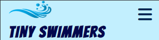

# Tiny Swimmers

The main goal of the Tiny Swimmers website is to promote swimming education among young children. It aim to highlight the importance of early exposure to swimming for safety, health, strengthening parent-child bonding and developmental benefits.

The live link can be found by clicking [here](https://bhagyashriyogeshpatil.github.io/TinySwimmers/).

## Project Overview

### Project Objective

The primary goal of the Tiny Swimmers website for infants and toddlers is to provide parents with all the necessary information and guidance they need to ensure their young children have a safe, comfortable, and enjoyable swimming experience

The target audience for the Tiny Swimmers website would be parents or guardians of young children, typically infants and toddlers. These parents are likely interested in enrolling their children in swimming lessons to instill water safety skills from an early age.

### User Stories

- As a user, I want to know what the website is about.
- As a user, I want a clear and intuitive navigation menu so that I can easily browse different sections of the website.
- As a user, I expect to be greeted with a welcoming homepage that captures my attention and provides key information about the website.
- As a user, I hope to find a dedicated section on the website that outlines the different courses offered for infants and toddlers, including details such as age requirements, skill level, schedule and price.
- As a user, I want to easily register my interest in joining courses at the Tiny Swimmers website for infants and toddlers so that I can secure a spot for my child and begin their swimming journey.
- As a user, I expect to find a clear and intuitive registration process on the website, where I can easily provide my contact information and indicate my interest in specific courses.
- As a user, I want to check out the company social media profiles.

### Design

For a clear understanding of the purpose of the website, it was designed to have three pages such as Home, Courses and Register Page. To attract the attention of the target audience, a logo with a splash image, a favicon with a swimming cartoon and a hero image with two young girls swimming in a swimming pool are used.

Semantic markup was used to ensure a well structured page.

The blue color theme was chosen to match the swimming pool theme and the image on the homepage. Alice Blue #E9F9FF serves as the background color, providing a clean and minimalist backdrop for text and other elements. To distinguish navbar and footer from main content color Onahau #C2EFFE is used. 

Media Queries were used to allow for the layout to adapt to all screen sizes maintaining the structural integrity of the website.

Poppins font from Google fonts was used throughout the whole website with a fallback to sans-serif. 

### Wireframes
Using Figma I created the wireframe for my site

## Features 

### Existing Features

- __Navigation Bar__

  - The navigation menu should be visible on all pages.
  - It includes links to Logo, Home page, Courses and Register page. Also nav bar is identical in each page to allow for easy navigation.
  - This section will allow the user to easily navigate from page to page across all devices without having to revert back to the previous page via the ‘back’ button.
  - Responsive navigation ensures that users can navigate the website effectively regardless of the device they are using.
  - The aria-label attribute is used to provide a labels or descriptions to elements that might not have a visible label, mainly for accessibility purposes.

- __Landing Page Hero section__

  - The hero section features an image of two young girls swimming in a pool, accompanied by the messages "Welcome to Tiny Swimmers". 
  - The selection of the image of two young girls swimming in a pool is relevant to the Tiny Swimmers website.
  - It contains Courses button that allows the user to navigate to the Courses page when clicked.

- __Intro section__

  - The Intro section provides brief information about the website, accompanied by the caption "Dive Into a World of Aquatic Adventures with Your Little One!"

- __Why section__

  - The Why section provides information about why to choose us, highlighting points such as Expert Instructors, Small Class Sizes, Warm Water Pools, Developmental Benefits, Family Bonding and Fun, and Lifelong Skill.

- __Courses section__

  - The courses section introduces two programs: "Infant Water Exploration" and "Toddler Swim and Play" courses.

- __Instructor section__

  - Instructor section contains circular images of two instructors. 

- __Register section__

  - The Register section prompts users to register with the caption "Ready to Dive In?"
  - There is a Register button that, when clicked, allows the user to navigate to the Register page.

- __Contact section__

  - The contact section provides details on how to contact Tinny Swimmers, including email address, phone number and location.
  - T. 

- __The Footer__ 

  - Links to social media sites - Youtube, Twitter, Instagram and Facebook. Are represented by their icons which gives a clean look to the footer.
  - The links will open to a new tab to allow easy navigation for the user. 

- __Courses Page__

  - The Courses Page offers details on two primary programs: "Infant Water Exploration" and "Toddler Swim and Play" courses.
  - Each course includes details covering the course description, age prerequisites, skill levels, schedules, and pricing.
  - There is a Register button that, when clicked, allows the user to navigate to the Register page.
  - There is an additional offer regarding an upcoming program.

- __Register Page__

  - This page will allow the user to get registered to Tiny Swimmers to start their running journey with the swimming. When registering for the Tiny Swimmers Course, users may be asked to provide various pieces of information to complete the registration process. The user will be asked to submit their full name, name of the child, email address, select course name and special requests regarding the registration process. By providing this information during the registration process, users can ensure that their child is enrolled properly in the Tiny Swimmers Course and that the program can accommodate any specific needs or preferences they may have. The aria-label attribute is used to provide a labels or descriptions to elements that might not have a visible label, mainly for accessibility purposes.

### Features Left to Implement

- Additional features to be implemented in the future include the addition of instructor profiles, a feedback form, and videos.

## Testing 
### Manual Testing User Stories

I used dev tools in chrome to test the responsiveness of the site. 
Expectation: As a user, I want to know what the website is about.
Result: As a user, I understand that this is the website for a swimming course offering courses for infants and toddlers.

Expectation: As a user, I want to ensure that the homepage loads properly and displays relevant content.
Result: Upon visiting the Tiny Swimmers website, the homepage loads smoothly, presenting relevant information, such as course offerings, why choose them, instructors and contact. I visited website with a welcoming homepage that captures my attention and provides key information about the website.

Expectation: As a user, I want a clear and intuitive navigation menu so that I can easily browse different sections of the website.
Result: As a user, I can easily navigate to home, course and Register page of website from navigation menu. Logo on each page navigates to Home page. 

Expectation: As a user, I hope to find a dedicated section on the website that outlines the different courses offered for infants and toddlers, including details such as age requirements, skill level, schedule and price.
Result: As a user, I found Courses page which provides information about description, age requirements, skill level, schedule and price

Expectation: As a user, I want to ensure that the course registration button functions correctly and redirects me to the registration page.
Result: As a user, I see that I can click the Register Now button on Home Page and Courses Page. Also able to fill the form to start swimming journey for little one.

Expectation:  As a user, I want to fill out the registration form for my child accurately and submit it.
Result: As a user, I can easily provide my contact information, select course and also able to provide any special request. Also, I can submit the form.

Expectation: As a user, I want to check out the company social media profiles.
Result: As a user, I see that social link icons open relevant websites in a new tab when clicked.

Expectation: As a user, I want to ensure that the registration form validates inputs correctly (e.g., email format, required fields).
Result: I validate user inputs, including email format and required fields, ensuring error-free registration process 

### Validator Testing 
#### HTML Validator

- Each html file was validated using [W3C validator](https://validator.w3.org/#validate_by_input).
- Initially, there were warning regarding  HTML headings structure and info about trailing slash on void elements. In the hero section, I adjusted the heading tags from h1 to h2. I removed the slashes from void elements across all three HTML files to ensure cleaner validation reports.

#### CSS Validator

- The CSS file was validated using [(Jigsaw) validator](https://jigsaw.w3.org/css-validator/) W3 Jigsaw CSS validator</a>. There were no errors. 
- 

#### Lighthouse

#### Bugs and Fixes

- Some bugs that were found and fixed:
Bug: The Submit button displayed a border and was positioned at the left-bottom corner of the form.
Fix: Removed the border from the Submit button and repositioned it to the bottom-left corner of the form.

Bug: The HTML validator issued a warning for the heading HTML element in the Hero section of Home Page.
Fix: By replacing h1 to h2 esolved the warning issued by the HTML validator for the heading HTML element in the Hero section.

Bug: In the registration form, there is no numerical limit set for the "Age" field.
Fix: Applied a numeric restriction like min, max and steps attribute to the "Age" field within the registration form.

Bug: The "Phone number" field in the registration form does not have a numerical limit, allowing the input of alphabetic characters.
Fix: Applied a numerical pattern to the "Phone number" field in the registration form and provided a placeholder indicating the required pattern.

Bug: Footer was different on Courses and Register page compaired to Home Page.
Fix: The mentor noticed and informed me. I copied the footer section of home page in other two pages.

## Deployment

- The website was developed using GitPod and deployed through GitHub Pages.
- For deploying with GitHub Pages the following steps were taken:

- 1. Navigate to the repository in GitHub
- 2. Select the Settings tab
- 3. On the left navigation menu, under Code and Automation, select Pages
- 4. Select Deploy from a branch under source
- 5. Select the main branch
- 6. After the pages reload, the link to the deployed page will show up at the top.

- The live link can be found by clicking [here](https://bhagyashriyogeshpatil.github.io/TinySwimmers/).

## Credits  

### Content 

+ [Favicon generator](https://realfavicongenerator.net/) – Used to create favicon used on website.
+ [Font Awesome](https://fontawesome.com/) - The icons were taken from 
+ [color palettes](https://coolors.co/) - Used for the selection of background and text colors.
+ [W3 Schools](https://www.w3schools.com/) - Used for variety of tutorials and deeper understanding of some important concepts related to both HTML and CSS.
+ [CSS-Tricks](https://css-tricks.com/snippets/css/a-guide-to-flexbox/) - used for understanding  CSS flexbox layout.
+ [optimize cls](https://web.dev/articles/optimize-cls) - used to change width and height property of Logo image with respect to aspect ratio.
+ The captions and text for the Home page was taken from Chatgpt

### Media

- The images used are from following sites:
  [Favicon, logo](https://www.vecteezy.com/)
  [Home page hero image](https://www.pexels.com/photo/2-girl-s-swimming-during-daytime-61129/)
  [Instructors](https://www.istockphoto.com/)
- I used for following site for optimising images for the web:
  [Optimise images for the web](https://compressnow.com/)

### Acknowledgements

-	To the Code Institute course material, as the basis of all my knowledge is from here.
-	To the Slack community as I have used the different channels to find answers to problems!
- Stack Overflow as a valuable resource for solving a couple of issues.
- [W3schools](https://www.w3schools.com/) and [Stack Overflow](https://stackoverflow.com/) for general reference.

I would also like to thank to:

-	My mentor Rahul, for his time, support and guidance throughout our video calls.
- Kay, my cohort facilitator for her time and support. 